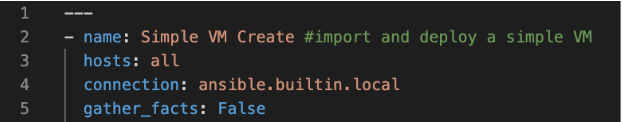

.. scale_computing.hypercore.quickstart:

****************
Quickstart Guide
****************

This guide will walk users through a few foundational Ansible terms and
concepts, introduce the HyperCore Collection, and provide guidance on
writing Playbooks.

Introduction
=============
Scale Computing recently launched the SC//HyperCore Collection for Ansible. This exciting tool gives MSPs and distributed edge
organizations the ability to implement declarative configuration
management in their HyperCore fleet. Ansible is an IT automation tool
designed to automate server provisioning and management via Playbooks.
These Playbooks are similar to scripts, but have two key benefits,
namely: they are human readable and idempotent, meaning they can be run
several times and are smart enough to only take actions that are
required (and skip those that aren't) to put a HyperCore cluster in the
desired state. These benefits make Ansible ideal for managing large
HyperCore fleets.

.. note::
   Ansible is an open source tool maintained by Red Hat. It is
   completely free to install and use. ScaleCare support may
   provide best-effort assistance in writing Playbooks and
   diagnosing issues. 

   However, the HyperCore Collection for Ansible is fully 
   supported by Red Hat for customers that purchase the 
   `Red Hat Ansible Automation Platform <https://www.ansible.com/products/automation-platform>`_.

   `Contact ScaleCare Support <https://www.scalecomputing.com/support>`_.

Overview and Terminology
========================

Before you can begin writing Playbooks and automating HyperCore
management, we must first cover a few important concepts. First, it is
important to note that Ansible is a powerful tool that gives users the
ability to accomplish the same task in a myriad of different ways. It
gives users the building blocks needed to automate their own processes.
Thus, this guide only scratches the surface of what can be accomplished
with Ansible.

Second, Ansible commands need to be run from an "Ansible Server" (also
called an "Ansible Control Host"). In some cases, this is actually a
dedicated physical server or VM, however this is not always necessary.
Users can run Ansible from a workstation, this local machine contains
the necessary Playbooks to run against the servers being managed.

Third, Open SSH is the default communication standard used by Ansible
for remote administration. Crucially, this is not how Ansible will
communicate with HyperCore clusters, as will be demonstrated later in
this guide. Now, let us turn to important terms and concepts.

Inventory
---------

Ansible is incredibly useful for managing many HyperCore clusters.
Ansible relies on an inventory file to establish which clusters you want
to target with your Playbooks. This file is most commonly formatted in
either INI or YAML and lists your clusters. For larger organizations,
the inventory is also the ideal location to organize your fleet,
particularly when you desire different cluster states based on different
criteria (location, size, purpose, etc.). The most basic YAML-formatted
inventory file is organized like this:

.. code-block:: yaml

   all:
     hosts:
       mail.example.com:
     children:
       webservers:
         hosts:
           foo.example.com:
           bar.example.com:
       dbservers:
         hosts:
           one.example.com:
           two.example.com:
           Three.example.com:

``hosts`` denotes individual target servers (in the case of HyperCore you
could point to a FQDN or IP address of a node in the cluster) while
``children:`` and signifiers like ``webservers:`` and ``dbservers:`` organize
hosts into different categories. A small HyperCore inventory might look
something like this:

Ansible Configuration File
---------------------------

When running Ansible commands and writing Playbooks it is important to
specify where your inventory is and other configuration specifics, like
your Ansible collection path. This file serves as the center to all of
your server interactions.

Upon installing Ansible, you will be provided with a default
configuration file **(ansible.cfg)**. The default configuration is a large
file that you can choose to use, however it is also fine to create your
own simplified version. The most important thing is to make sure your
work is referencing the correct configuration file. The easiest way to
achieve this is by including an **ansible.cfg** in the directory where you
are working with Ansible or setting it as an environment variable.

For the purposes of this guide, you need to make sure your configuration
file specifies where your inventory is located. All that is required is
to set ``inventory`` = [folder that contains your inventory in your working
ansible directory]. You can reference a specific file or an entire
inventory folder. An example of a simple configuration file looks like
this:

.. images: images/qs_configuration.png

Ansible Module
--------------

Now that you are familiar with Ansible inventories and configuration
files we can turn to the meat of Ansible and the HyperCore Collection
modules. Ansible Modules are units of code that can control the servers
that you are managing with Ansible. After installing Ansible, you will
have access to a library of modules that give you the ability to execute
specific tasks on remote servers through Playbooks and individual
commands. Scale Computing has made managing your HyperCore fleet via
Ansible possible by developing our own set of modules that call existing
cluster REST API endpoints. Extensive documentation on our current
available modules can be found
`here <https://galaxy.ansible.com/scale_computing/hypercore>`__.

For example: `scale_computing.hypercore.vm <../collections/scale_computing/hypercore/vm_module.html>`_
is the module that will allow you to create, update, and delete virtual
machines. When you begin writing Playbooks, you will reference a specific 
module when attempting to automate a task associated with that said module 
is equipped to handle.

Ansible Playbook
-----------------

Finally, Playbooks are the most important piece of Ansible. Playbooks
allow you to automate tasks that would normally need to be done more
than once across the clusters in your fleet. While similar to scripts,
Playbooks are much easier to write because they are human readable.
Additionally, we have in-depth documentation about every module
available in the Ansible collection, with specific examples of how each
module can be written as a task that is part of a Playbook.
Additionally, Playbooks and Ansible are idempotent, meaning that they
are smart enough to know if a cluster already has a desired
configuration and skip tasks that do not need repeated.

At a high level, Playbooks typically begin with the author specifying
which hosts (in our case HyperCore clusters) are going to be targeted.
They will then establish the method by which Ansible will connect to the
remote hosts (in our case this will be ``connection:
ansible.builtin.local``). Once these have been established, the author
can begin writing tasks in the order in which they will be carried out;
calling out the necessary Ansible modules and module parameters along
the way.

In a future section, you will get an overview of how to start writing
your own Playbooks.

Ansible Installation
====================

Now that you have a basic understanding of key Ansible concepts we can turn to installing Ansible and the HyperCore Collection. 

.. note:: 
   Your Ansible server (where you run your commands) must be a UNIX-like machine with Python 3.8 or newer. This guide uses an 
   Ubuntu 20.04 virtual machine to demonstrate how to install Ansible. 

1. Install Ansible: 
``sudo apt install ansible``

a. This command will install of the necessary packages, libraries, and bianaries needed to run Ansible. 

2. Now that you have installed Ansible, you need to install the HyperCore Collection with this command: 
``ansible-galaxy collection install scale_computing.hypercore``

a. Installing the HyperCore Collection will give you access to all of the modules we have built to allow you to automate tasks within HyperCore. 
    
b. Full documentation on our collection can be found at `Ansible galaxy <https://galaxy.ansible.com/scale_computing/hypercore>`_.

3. You are now ready to start using Ansible with your HyperCore clusters! Before turning to writing Playbooks, you can test that the collection was successfully installed by running single-module commands. 

4. Specify a HyperCore cluster to test an Ansible module against with the following commands:

.. code-block:: shell

    export SC_HOST=https://1.2.3.4
    export SC_USERNAME=admin
    export SC_PASSWORD= admin_pass

5. You can now run your first Ansible command against the test cluster you previously specified! 

Enter the following command:
``ansible -i localhost, --connection=ansible.builtin.local all -m scale_computing.hypercore.vm_info``

This command is targeting your local host *(localhost)*, using the required connection protocol for HyperCore clusters instead of default ssh *(--connection=ansible.builtin.local)*, using the ``scale_computing.hypercore.vm_info`` module. If successful, this command should return information about every VM running on your target cluster.

.. image: images/qs_install3.png

Congratulations! You have successfully installed Ansible and the HyperCore Collection. The next section will walk you through setting up a basic inventory file and writing a Playbook. 

Getting Started with Playbooks
==============================

With Ansible and the HyperCore Collection downloaded and installed, you are now ready to start writing your own Playbooks. As mentioned earlier, Playbooks are essentially scripts that automate a series of tasks to be run against your HyperCore fleet. However, Playbooks are much easier to write than normal scripts because they are simply YAML-formatted text files that are interpreted by Ansible. 

While exporting HyperCore cluster information at the command line works perfectly fine for one-off Ansible commands (like in the previous section), Playbooks rely on an inventory file to establish which clusters are in  your fleet and are automated. In order to get started writing Playbooks, you should first create an inventory file in the directory where you downloaded and installed Ansible and the HyperCore Collection.

1. Create a folder called ``/inventory``.

2. Create a file called ``inventory`` within this folder.

a. Inventory files can be YAML, JSON, and INI formatted.
 
.. note:: This can be done easily via a text editor like nano or a source-code editor like Visual Studio Code (VSC).
 
b. This example includes groups (which are entirely optional), but demonstrate how an inventory file could be used to organize a larger fleet. 

c. Here is a handy reference for `creating more complex inventory files <https://docs.ansible.com/ansible/2.5/user_guide/intro_inventory.html>`_.

.. code-block:: yaml

    all:
      children:
        hypercore:
          children:
            testclusters:
              hosts:
                "{your cluster IP address":
              vars:
            scale_user: {your cluster user account}
            scale_pass: {your account password}

3. Once you have created a basic inventory, save the file.
 
.. note:: YAML formatting is picky and can disrupt running on Playbooks. We recommend using a source-code editor with an Ansible plug-in to help diagnose formatting issues. 

In the previous section, you created an inventory that contains one cluster. Please note that in reality, Ansible inventories will contain all of the clusters within your fleet. Inventories can be a single file or a collection of several files that call out different host groups and host variables. Which strategy you determine when building your full inventory will depend on the size of your fleet and the granularity you require when running different types of Playbooks. 

Due to the flexibility of Ansible, you will also need to create an Ansible Configuration file to set your defaults, like calling out which inventory Ansible should reference. For the purposes of this guide, you only need to make sure your configuration file specifies that your inventory is equal to the folder that contains your inventory in your working Ansible directory. 

1. Create new file called ``ansible.cfg`` in the directory you are using for Ansible.

2. Open an editing tool and create the following:

3. This file allows you to set basic Ansible defaults, more importantly, you are instructing Ansible to reference your ``inventory`` file that you created in the previous step. 

.. note:: This can be a full file path if you are referencing a specific file or simply call out the entire folder (if you are distributing your inventory amongst several files). In this case it does not really matter since you only have one file in your inventory folder. 

With basic inventory and ``ansbile.cfg`` files created, we can now begin writing Playbooks.
 
Writing Playbooks
==============================

This guide will now demonstrate how to create a Playbook that will create a VM on your test cluster.

1. Create a new file called ``simple_vm_create.yml`` in the directory you are using for Ansible.

2. Open an editing tool and begin your Playbook with the following:

.. note:: All YAML files, including Playbooks, begin with "---" and the information that specifies the purpose of the Playbook. This identifies host targets, whether to gather basic facts about the target hosts, and how Ansible will communicate with those targets. Remember, SSH is the default protocol used by Ansible, so when writing Playbooks with the HyperCore Collection, you should specify ``ansible.builtin.local``.

3. After specifying this information, you can start adding tasks to your Playbook

4. A few lines after your introduction block of test write 
``tasks:``.

	a. This line tells Ansible that the text below will outline specific actions to be performed. 
	
	b. ``tasks:`` should be lined up directly below ``gather_facts: False``

5. Each individual task in a Playbook shoule begin with ``- name:`` and a concise name that explains the purpose of that task. This name helps you understand what each task in a Playbook is attempting to accomplish. 

6. The next line specifies which module you are using from the HyperCore Collecction to archieve the task. Right now the HyperCore Collection contains 19 individual modules that facilitate actions related to workload lifecycle management.
   The best place to start with writing and formatting tasks using these modules is our `published documentation <https://galaxy.ansible.com/scale_computing/hypercore>`_.
   At this link, you will find clear explanations of what each module enables and examples on how to correctly write a task with each module.

7. For the purposes of this guide, you can reference the `scale_computing.hypercore.vm <../collections/scale_computing/hypercore/vm_module.html>`_ module then copy and paste the example task for creating a VM into your Playbook.
   A valid `cloud_init user data <https://github.com/ScaleComputing/HyperCoreAnsibleCollection/blob/main/examples/cloud-init-user-data-example.yml>`_ sample file is available.

.. code-block:: yaml

    - name: Create and start the VM with disks, nics and boot devices set. Attach ISO onto the VM. Add cloud init data.
      scale_computing.hypercore.vm:
        vm_name: vm-integration-test-vm
        description: Demo VM
        state: present
        tags:
           - my-group
           - mytag1
           - mytag2
        memory: "{{ 512 MB | human_to_bytes }}"
        vcpu: 2
        attach_guest_tools_iso: true
        power_state: start
        force_reboot: true
        shutdown_timeout: "{{ '5 minutes' | community.general.to_time_unit('seconds') }}"
        disks:
          - type: virtio_disk
            disk_slot: 0
            size: "{{ '10.1 GB' | human_to_bytes }}"
          - type: ide_cdrom
            disk_slot: 0
            iso_name: TinyCore-current.iso
        nics:
          - vlan: 0
            type: RTL8139
        boot_devices:
          - type: virtio_disk
            disk_slot: 0
          - type: nic
            nic_vlan: 0
        cloud_init:
          user_data: |
            #cloud-config
            valid:
            - yaml: 1
            - expression: 2
          meta_data: "{{ lookup('file', 'cloud-init-user-data-example.yml') }}"
    register: result

8. After copying and pasting the task into your editor of choice you only need to make a few changes to run the Playbook.

a. First, directly under ``scale_computing.hypercore.vm:``, insert a new code block that looks like this:

 
b. Second, delete the following section entirely:

.. code-block:: yaml

   cloud_init:
     user_data:
       #cloud-config
	  valid:
      - yaml: 1
      - expression: 2
    meta_data: "{{ lookup('file', 'cloud-init-user-data-example.yml') }}"

c. This portion of the task facilitates passing configuration information to a cloud image for automatic in-guest customization via cloud-init, which is out of the scope of this guide. 

.. note:: ``attach_guest_tools_iso: true`` will not attach Scale Computing guest tools in this example because we are deploying a Linux VM. The current collection only supports attaching the guest tools for Windows machines. 

9. Once these changes have been made, you can go through and edit all of the VM settings to your liking. Ultimately, your Playbook should look like this:

At this point you can save your Playbook in your working Ansible directory and test it against your cluster. 

10. Using the command line of your Ansible server type the following:

.. code-block:: shell

    ansible-playbook -i /path/to/your/inventory.yml/path/to/your/playbook.yml

a. For example, my command looks like this:

.. code-block:: shell

    ansible-playbook -i /Users/metchason/ansible_collections/scale_computing/hypercore/inventory/inventory.yml 
    /Users/metchason/ansible_collections/scale_computing/hypercore/Mitch_Playbooks/windows_template_deploy.yml

b. If successful, you will see an output at the command line that looks like this, as well as a new VM running on your cluster (or clusters).

.. image: images/qs_wplaybooks6.png

11. Finally, if you want to test Ansible's idempotency you can re-run the exact same Playbook again with no changes. As long as you haven't changed anything about the VM, Ansible will be able to see that the VM you desire is already on the cluster and skip creating a new one. The result is called out as ``ok`` in the play recap. 

Conclusion
==========

Congratulations, you now have a working understanding of how to get started with the HyperCore Collection for Ansible. With these fundamentals in place, you can start to write Playbooks that 
automate several tasks. Remember, our documentation that can be accessed via `Ansible Galaxy <https://galaxy.ansible.com/scale_computing/hypercore>`__ is a great place to start when writing new tasks and using new modules. As a good rule of thumb, 
if you find that you're needing to manually accomplish the same task across your fleet of HyperCore clusters you likely have a great opportunity to automate said task with Ansible.

Feedback & Support
==================

Document Feedback
-----------------
Scale Computing welcomes your suggestions for improving our documentation. Please send your feedback to `documentation@scalecomputing.com <documentation@scalecomputing.com>`__.

Technical Support and Resources
-------------------------------
There are many technical support resources available for use. Access this document, and many others, at `Scale Computing Support <http://www.scalecomputing.com/support/login/>`_

	`Partner Portal - Partner and Distributor use only <https://partners.scalecomputing.com/English/>`_

	`User Community - Customer focused, including our online forum <https://community.scalecomputing.com/s/>`_
